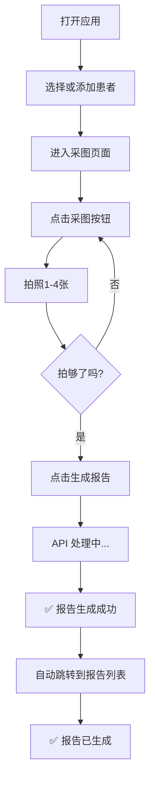

# 🚀 立即开始使用 - 生成报告功能

## 5 分钟快速启动

### 1️⃣ 打开 PowerShell（第一个窗口）
```powershell
cd "C:\Users\1\Desktop\新\red_pdf"
conda activate dip
python thermal_api.py
```

**看到这样的输出说明成功：**
```
 * Running on http://127.0.0.1:5000
 * Press CTRL+C to quit
```

**保持这个窗口打开！**

---

### 2️⃣ 打开 HBuilder 并启动应用（第二个窗口）
1. 打开 HBuilder
2. 菜单：文件 → 打开项目 → 选择 `C:\Users\1\Desktop\新`
3. 按 `Ctrl+Alt+H` 启动到浏览器

**或者按照这个步骤：**
1. 打开 HBuilder
2. 找到项目文件夹（左边）
3. 右键 → 运行 → 运行到浏览器

---

### 3️⃣ 开始使用

#### 首次使用流程：
1. **进入首页** → 看到"患者信息"界面
2. **点击"添加患者"** → 输入患者信息
   - 患者名称：例如"赵女士"
   - 年龄：35
   - 性别：女
   - 点击"下一步"
3. **选择采集类型** → 选择"全科" 或 "面诊"
4. **进入采图页面** → 开始拍照

#### 采图步骤：
1. **点击"采图"按钮**（中间大圆形）
   - 弹出摄像头
   - 拍照 1-4 张（根据类型）
   - 看到"已采集 X/4" 提示

2. **拍够足够的照片后，点击"生成报告"** 按钮

#### 报告生成过程：
```
点击"生成报告" 
    ↓
看到"正在生成报告..." （加载提示）
    ↓
等待 2-3 秒...
    ↓
看到"✅ 报告生成成功！" （成功提示）
    ↓
自动跳转到报告列表
    ↓
看到新生成的报告在列表中！✅
```

---

## ✅ 验证成功的标志

### API 启动成功 ✅
```
 * Running on http://127.0.0.1:5000
```

### 报告生成成功 ✅
- 显示 `✅ 报告生成成功！` 提示
- 自动跳转到报告列表
- 报告出现在列表中

### 在浏览器开发工具中验证 (F12)
1. 按 `F12` 打开开发工具
2. 点击"生成报告"
3. 切换到 **Network** 标签
4. 看到 `POST` 请求到 `/api/v1/generate-pdf`
5. 响应状态码是 `200` ✅

---

## 🐛 如果出现错误

### 错误 1：❌ 无法连接到 API 服务
**原因：** API 没有启动

**解决：**
1. 检查第一个 PowerShell 窗口
2. 确保显示 `Running on http://127.0.0.1:5000`
3. 如果没有，重新运行：
```powershell
conda activate dip
python thermal_api.py
```

---

### 错误 2：❌ 请先采集图片
**原因：** 没有拍照

**解决：**
1. 返回采图页面
2. 点击"采图"按钮拍照
3. 拍照 1-4 张
4. 然后点击"生成报告"

---

### 错误 3：❌ 生成失败（其他错误）
**检查步骤：**
1. 按 `F12` 打开浏览器开发工具
2. 点击"生成报告"
3. 看 **Console** 标签中的错误信息
4. 看 **Network** 标签中 API 请求的详细信息

---

## 📊 实际操作示例

### 示例患者信息
```
患者名称：赵女士
年龄：35
性别：女
采集类型：全科（4 张照片）
```

### 报告会自动生成
```
报告名称：热图分析报告_赵女士_2026-03-22 14:30:25
文件格式：DOCX（可编辑）
保存位置：应用本地存储
```

---

## 💡 常用快捷键

| 快捷键 | 功能 |
|-------|------|
| `Ctrl+Alt+H` | HBuilder 运行到浏览器 |
| `F12` | 打开浏览器开发工具 |
| `Ctrl+C` | 停止 Python 脚本（在 PowerShell 中） |
| `Ctrl+K` | 清空 PowerShell 屏幕 |

---

## 📝 完整的用户流程



---

## 🔍 浏览器开发工具调试指南

### 查看 API 请求
1. 按 `F12` → **Network** 标签
2. 点击"生成报告"
3. 看到 `POST /api/v1/generate-pdf` 请求
4. 点击查看详细信息

### 查看控制台日志
1. 按 `F12` → **Console** 标签
2. 点击"生成报告"
3. 看到日志输出（包括错误）：
   ```
   API 响应状态码: 200
   ✅ 报告生成成功
   ```

### 查看本地存储
1. 按 `F12` → **Application** 标签
2. 左边菜单：LocalStorage
3. 点击应用 URL
4. 找到 `person_reports_[患者ID]` 的键
5. 可以看到保存的所有报告

---

## ✨ 功能特点

✅ **自动生成** - 一键生成，无需复杂操作
✅ **快速处理** - 2-3 秒完成报告生成
✅ **离线保存** - 报告自动保存到本地，支持离线查看
✅ **自动导航** - 生成后自动跳转到报告列表
✅ **错误提示** - 出错时清楚的错误信息和解决建议
✅ **患者隔离** - 每个患者的报告单独存储

---

## 🎯 下一步

1. **启动 API** → `python thermal_api.py`
2. **启动应用** → HBuilder 运行到浏览器
3. **测试功能** → 按照上面的步骤操作
4. **验证成功** → 看到报告生成成功提示 ✅

---

**就是这样！** 现在你可以开始使用生成报告功能了。

有任何问题，直接看 **❌ 如果出现错误** 部分的解决方案。
